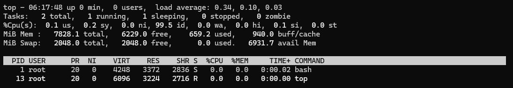
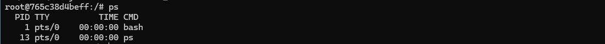
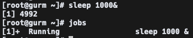
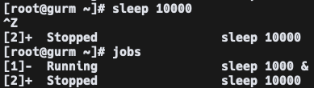

# top

'top'명령어는 리눅스 시스템에서 실행 중인 프로세스와 시스템의 자원 사용 현황을 실시간으로 보여주는 강력한 유틸리티입니다.

### 기본 사용법

터미널에서 'top' 명령어를 입력하고 엔터를 누르면 됩니다.  
`top [option]`

### 주요 기능

- **실시간 모니터링**: 'top' 명령어는 일정 주기로 화면을 업데이트하여 시스템 성능을 실시간으로 모니터링 할 수 있습니다.
- **프로세스 정보**: 실행 중인 프로세스의 PID(프로세스 ID), 사용자, 우선순위, 메모리 사용량, CPU사용량 등을 보여줍니다.
- **시스템 요약**: 화면 상단에 시스템의 전반적인 성능 지표를 요약하여 표시합니다. 이는 시스템 가동 시간, 사용자 수, 로드 평균, CPU 상태, 메모리 사용량, 스왑 공간 사용량 등을 포함합니다.

### 주요 옵션

| 옵션     | 설명                                    |
| -------- | --------------------------------------- |
| -d delay | 지정한 시간(delay) 간격으로 정보를 출력 |
| -n num   | 지정한 횟수(num)만큼 정보를 출력        |
| -p pid   | 지정한 프로세스 id(pid)의 정보만 출력   |

### 사용화면 및 요소 설명

</img>

- 첫번째 줄
  - 현재 시간: 06:17:48
  - 서버 가동 후 유지시간: up 0 min
  - 현재 접속자 수: 0user
  - 평균 부하(1분, 5분, 15분): load average: 0.34, 0.10, 0.03
- 두번째 줄
  - 프로세스 상태 (전체, 실행중, 유후, 정지, 좀비)
- 세번째 줄
  - cpu 상태
- 네번째 줄
  - 메모리 상태
- 다섯번째 줄
  - swap 메모리 상태
- 여섯번째 줄 부터
  - PID: 프로세스 ID
  - USER: 소유자
  - PR: 우선순위
  - NI: nice 우선순위
  - VIRT: 가상메모리 사용량
  - RES: 실제 물리메모리 사용량
  - SHR: 공유 메모리 사용량
  - S: 프로세스 상태

---

# ps

ps 명령어는 Process State의 약자로 현재 실행중인 프로세스와 상태를 출력하는 명령어 입니다.

### 기본 사용법

터미널에서 'ps' 명령어를 입력하고 엔터를 누르면 됩니다.  
`ps [option]`

### 주요 옵션

| 옵션         | 설명                                            |
| ------------ | ----------------------------------------------- |
| -A           | 모든 프로세스를 출력                            |
| -u username  | 특정 사용자가 실행한 프로세스 표시              |
| -p pid       | 지정한 프로세스 id(pid)의 정보만 출력           |
| -ef --forest | 프로세스 간의 부모-자식 관계를 트리 구조로 표시 |

### 사용화면 및 요소 설명

</img>

- PID
  - 프로세스의 식별 번호
- TTY
  - 프로세스와 연결된 터미널
- TIME
  - 총 CPU 사용 시간
- CMD
  - 프로세스의 실행 명령행

---

# jobs

'jobs' 명령어는 현재 쉘 세션에서 실행 중인 백그라운드 및 포그라운드 작업의 목록을 표시하는 명령어 입니다. 이 명령어는 주로 작업 제어와 관련된 정보를 제공하며 사용자에게 어떤 작업이 실행 중인지, 멈춰 있는지 등을 확인할 수 있게 해줍니다.

### 기본 사용법

터미널에서 'jobs' 명령어를 입력하고 엔터를 누르면 됩니다.  
`jobs [option] [job]`

### 출력되는 상태값

| 상태       | 설명                                     |
| ---------- | ---------------------------------------- |
| Running    | 작업이 계속 진행중임                     |
| Done       | 작업이 완료되어 0을 반환                 |
| Done(code) | 작업이 종료되었으며 0이 아닌 코드를 반환 |
| Stopped    | 작업이 일시 중단                         |

### 사용 예시

</img>  
sleep 1000& 명령어로 백그라운드에서 실행 후 jobs를 통해 확인하면  
작업번호 1번으로 Running 상태인 것을 확인할 수 있습니다.

</img>  
sleep 10000 명령어를 포그라운드에서 실행하고 ctrl + z를 통해 일시중지합니다.  
jobs를 통해 확인하면 작업번호 2번에 Stopped 상태인 것을 확인할 수 있습니다.

---

# kill

'kill' 명령어는 주로 프로세스가 더 이상 필요하지 않거나 비정상적으로 동작할 때 사용됩니다.

### 기본 사용법

'kill'명령어는 다음과 같은 형식으로 사용됩니다.  
`kill [option] <pid>`

### 주요 옵션

| 옵션        | 설명                                                                                          |
| ----------- | --------------------------------------------------------------------------------------------- |
| -s <signal> | 특정 시그널(signal)을 사용하여 프로세스를 종료합니다. 기본적으로 SIGTERM 시그널이 적용됩니다. |
| -l, --list  | 지원되는 시그널(signal) 목록을 출력합니다.                                                    |
| -a, --all   | 현재 사용자에 속한 모든 프로세스를 종료합니다.                                                |
| -q, --queue | 프로세스에 시그널을 보내는 대신 시그널을 대기열에 추가합니다.                                 |
